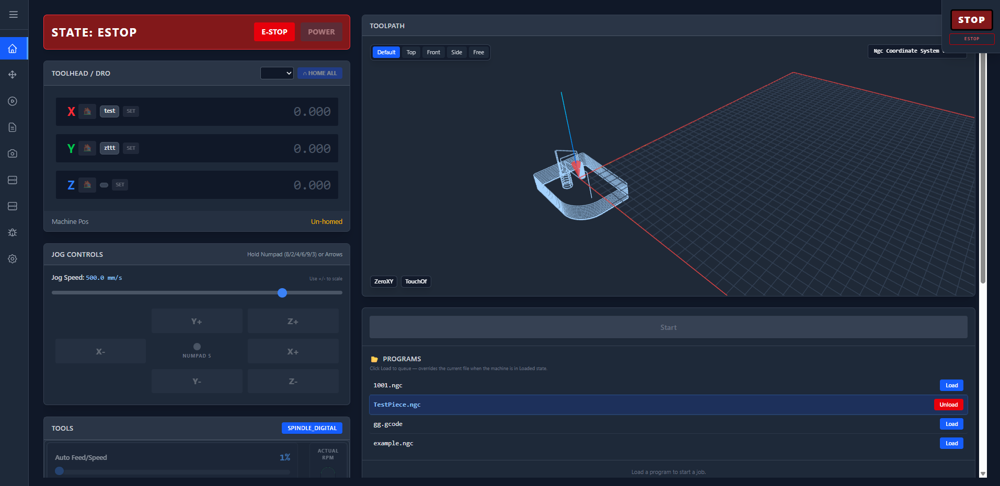
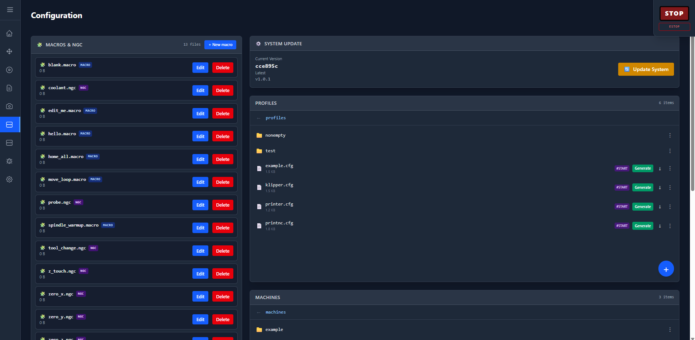
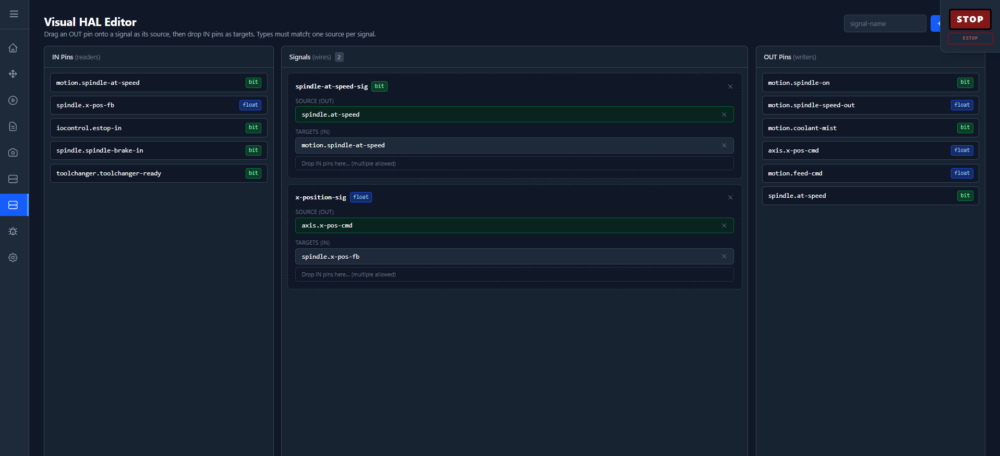

# LinuxCNC Web UI

A web-based operator interface for LinuxCNC. The backend wraps the LinuxCNC Python API and HAL for the machine connection and streams everything to a browser frontend — allowing online monitoring and providing all necessary features of a CNC controller: DRO, jogging, homing, program execution, macros and more.



## Features

- **Web app** — accessible via HTTP, HTTPS or installed as an app (PWA); fully local use is possible
- **Manual control** — DRO with live position feedback, jogging of all axes and homing
- **Program execution** — upload, start, stop and pause NGC programs, including editing
- **NGC code viewer** — 3D toolpath rendering of the loaded program
- **Built-in editors** — for NGC files as well as machine configuration files
- **Camera support** — USB cameras and webcams can be integrated into the UI
- **Macros** — user-defined macros can be called from the UI and are added to it dynamically
- **Near real-time data** — 10 Hz telemetry over a WebSocket connection
- **REST API** — a typed OpenAPI contract for every machine action



## Planned

- Finish the functionality of the visual hal editor

  

- Finish the template generator
- Test heaters / thermistors (currently in progress)
- Add laser support
- Add plasma cutter support
- Unify the UI

## Challenges

- **JS to TS migration** — the initial version was written in JavaScript; I am currently converting it to TypeScript.
- **Keeping control over AI-generated code** — solved by adding more documentation and examples and keeping the prompts small, so every generated solution stays reviewable and maintainable.
- **PWA support over HTTPS on a local URL** — a PWA requires a secure context, which is impossible to get for a plain LAN address. A local root CA created with `mkcert` would work, but it would require every user to trust a random CA, and I wanted to keep plain HTTP available as well. Solution: a nginx reverse proxy that terminates HTTPS.
- **AI prefers dicts over strictly typed classes** — this caused problems with slow conversions during the mocking phase. Solution: gradually convert to dataclasses, as expected by the REST API, and apply design patterns like factories and mappers. In the beginning, with JavaScript and Python dicts, the only saving grace was the strictly enforced OpenAPI schema, which provided at least some typing.
- **HTTPS prevents webcams from being integrated into the UI** — secure pages cannot embed the camera streams directly. Solution: the cameras are now connected to the backend, which forwards the streams to the frontend.

## Install

Just execute `install.sh` on the LinuxCNC machine.

Starting: if the machine is configured correctly, simply call

```bash
linuxcnc yourpath/machine.ini
```

## Architecture

Monorepo with two services:

```
Browser (Vue 3 SPA / PWA)
   │   REST  /api/v1/*          WebSocket 10 Hz telemetry
   ▼
FastAPI backend
   │   routers → services → mappers → DTOs
   ▼
Hardware abstraction layer
   ├── LinuxCNC Python API (NML status / command / error channels)
   ├── HAL pin & signal access
   └── Mock hardware layer (offline development on any OS)
```

| Folder | Purpose |
|--------|---------|
| `backend/` | FastAPI app: REST endpoints, 10 Hz WebSocket telemetry, hardware abstraction with automatic mock fallback, DTOs (frozen dataclasses) mapped through factories and mappers into Pydantic response models. |
| `frontend/` | Vue 3 + TypeScript SPA: Pinia stores, Tailwind CSS, Three.js toolpath viewer, CodeMirror editors, and a typed API client generated from the backend's OpenAPI schema. |
| `machine_config/` | Operator data — machine profiles and the live active configuration. |
| `nc_files/` | Uploaded NGC programs. |

The backend polls the machine over NML at 10 Hz, maps the raw status into typed DTOs, computes deltas and broadcasts them over the WebSocket so the frontend always renders near-real-time state with minimal traffic. Every machine action goes through the same typed REST contract the generated frontend client is built from, keeping both ends in sync by construction.

Both sides have their own test suites: `pytest` for the backend and `node --test` for the frontend.
